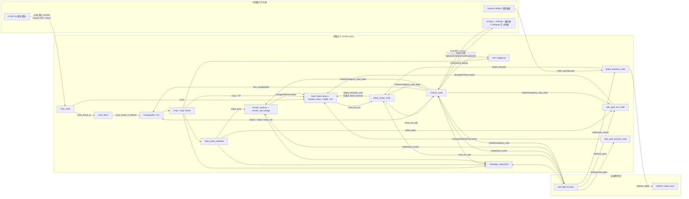

# CAR_PROJECT_A1 汇川伺服四轮差速小车项目

本文档是当前项目的总说明，以根目录下的 `open_all.sh`、`open_all_log.sh` 和
`lidar/chapt1_ws/src/lidar_py` 中的实际代码为准。项目根目录和运行链路目录均使用 ASCII
名称，避免 colcon、rosidl、CMake、Node.js 和 Shell 在中文路径下出现兼容问题。

当前系统运行环境为 Ubuntu 24.04 + ROS2 Jazzy，目标计算平台为树莓派 5。系统把
LD14P 二维激光雷达、Gemini2 深度相机、STM32/CANopen 汇川伺服底盘、Cartographer、
Nav2、视觉近地面避障、自动 Frontier 探索、网页控制台和 SLAM 日志整合为一套链路。

## 1. 当前能力

- 使用 LD14P 二维激光雷达和 Cartographer 进行在线二维建图。
- 使用 STM32 上行的 `yaw + vx + wz + MCU tick` 生成 `/odom` 和平面 IMU。
- 使用 Jazzy 原生 Nav2 和 `frontier_exploration_ros2` 完成网页选点导航与自动 Frontier 探索。
- 使用 State Lattice 全局规划、Rotation Shim、DWB 和定制行为树改善四轮差速车导航。
- 使用 Gemini2 SDK 读取 RGB 与深度图，检测二维雷达扫描不到的低矮障碍。
- 在 Nav2 或网页遥控速度上叠加视觉避障，统一输出 `/cmd_vel_safe`。
- 将 `/cmd_vel_safe` 换算为左右轮速度，再组装成四轮 `AA 55` 速度帧发送给 STM32。
- 网页显示 RGB 避障画面、实时地图、车体位姿、预览路线、Nav2 路线和串口数据帧。
- 网页支持八向遥控、控制权切换、回响开关、软件急停、下位机锁存急停、自动建图和日志开关。
- 普通启动不保存最终地图；Log 启动在退出时保存 PGM、YAML 和 PBStream。

## 2. 系统总拓扑

### 2.1 拓扑模块说明

下表与后面的拓扑图一一对应。图中的箭头表示数据或控制方向，不表示所有模块都在独立
终端中运行；多数 ROS 节点由一键 launch 统一启动。

| 图中名称 | 所属层 | 主要作用 | 主要输入 | 主要输出 |
|---|---|---|---|---|
| `LD14P 2D 激光雷达` | 硬件 | 扫描车体周围的二维距离和反射强度，是建图与大范围避障的主要传感器。 | 雷达自身旋转扫描 | 115200 波特率、47 B LD14P 串口帧 |
| `Gemini2 RGB-D 深度相机` | 硬件 | 提供 RGB 和深度图，识别二维雷达扫不到的近地面低矮障碍。 | 环境彩色/深度信息 | SDK RGB/Depth 帧 |
| `STM32 + JY901B + 编码器 + CANopen 汇川伺服` | 下位机 | 读取编码器和陀螺仪、控制四台伺服、接收上位机速度和控制命令。 | AA55 控制帧、PS2 手柄、编码器、JY901B | 0x07 NAVI、回响帧、CANopen 电机控制 |
| `lidar_node` | ROS 驱动 | 拆解 LD14P 帧、校验 CRC、映射设备时间戳、生成 LaserScan，并发布雷达静态 TF。 | 雷达串口字节流 | `/scan`、`/scan_timed`、`/scan_timed_v2`、`base_link -> laser_frame` |
| `laser_filters` | ROS 预处理 | 过滤过近、过远和孤立散斑点，减少建图噪声。 | `/scan_timed_v2` | `/scan_timed_v2_filtered` |
| `chassis_node` | ROS 底盘桥 | 解析 STM32 NAVI/回响，生成 odom 和 IMU；把安全 Twist 换算为四轮 AA55 帧；保存网页共享控制状态。 | STM32 串口、`/cmd_vel_safe`、网页控制 | `/odom`、`/imu_cartographer`、TF、AA55、控制/串口调试状态 |
| `Cartographer V13` | SLAM | 融合过滤后的激光、里程计和 IMU，执行扫描匹配、子图构建和回环优化。 | 激光、`/odom`、`/imu_cartographer` | 轨迹、子图、`map -> odom` |
| `/map + map->odom` | 地图/TF 结果 | 表示 Cartographer 当前构建的占据栅格地图和全局定位修正。 | Cartographer 轨迹与子图 | `/map`、`map -> odom`，供 Nav2、网页、RViz、Frontier 和日志使用 |
| `robot_pose_publisher` | ROS 显示桥 | 从 TF 查询 `map -> base_link`，生成网页和 Frontier 易用的机器人位姿；网页 yaw 仅做轻度显示平滑。 | TF | `/robot_pose` |
| `Nav2 State Lattice + Rotation Shim + DWB + BT` | 导航 | 计算全局路线、局部速度和恢复动作，不直接操作串口。 | `/map`、TF、`/scan`、`/depth_obstacle_scan`、目标点 | `/plan`、`/cmd_vel_nav`、导航 Action 状态 |
| `frontier_explorer` | 自动建图 | 使用 `auto_mapping_v1` 的 Jazzy 原生 C++ 算法选择可达 Frontier，并向 Nav2 连续提交探索目标。 | `/map`、TF、全局/局部 costmap、控制服务 | `NavigateToPose` 目标、Frontier 标记和完成事件 |
| `frontier_web_bridge` | 网页探索桥 | 保持既有网页开关/状态接口，并将请求转换为原生 Frontier 控制服务；人工目标优先时负责停用探索。 | `/robot/web_control`、`/control_exploration`、Nav2 Action 状态 | `/auto_mapping/status`、`/auto_mapping/set_enabled` |
| `depth_obstacle_node` | 视觉避障 | SDK 读取 Gemini2，采集地面 Baseline，计算九区障碍、距离、面积和左右风险。 | RGB/Depth、网页 Baseline/调试命令 | `/depth_obstacle`、`/depth/baseline_ready`、MJPEG |
| `safety_fusion_node` | 速度/障碍仲裁层 | 在网页遥控和 Nav2 之间选取唯一速度源，应用安全锁和带状态的视觉修正，并把低障碍转换为 Nav2 可识别的虚拟扫描。 | `/cmd_vel_web`、`/cmd_vel_nav`、深度障碍、急停状态 | `/cmd_vel_safe`、`/depth_obstacle_scan` |
| `web_goal_nav_node` | 网页导航桥 | 把网页确认的目标交给 Nav2；手动目标优先于 Frontier；急停时取消网页导航。 | `/web/nav_goal`、`/robot_pose`、急停状态 | `NavigateToPose` Action 目标 |
| `web_path_preview_node` | 路径预览桥 | 对尚未确认的网页标点调用规划器，只预览路线，不驱动车辆。 | `/web/preview_goal` | `/web/preview_path` |
| `slam_logger.py` | 日志 | 按网页设定的间隔记录地图、车体位姿和 NAVI 原始/解析数据。 | `/map`、`/robot/serial_debug`、日志开关 | `SLAM_Log/` 中的 PGM/YAML/PNG/JSON |
| `rosbridge_websocket` | 网络桥 | 把浏览器的 WebSocket 消息转换为 ROS topic，反向把 ROS 状态发送到网页。 | TCP 9090 WebSocket、ROS topic | 浏览器与 ROS2 的双向通信 |
| `Vite Web Console` | 网页 | 显示地图、路线、RGB、位姿和串口帧，并提供遥控、导航、自动建图、急停和日志控制。 | ROSBridge、MJPEG、用户操作 | 网页 ROS topic/JSON 命令和目标点 |
| `MJPEG /video_feed` | 视频服务 | 将已经绘制避障框、障碍点和调试文字的 RGB 图像送到局域网浏览器。 | 视觉节点标注后的 RGB 图 | `http://机器人IP:8080/video_feed` |

拓扑图中的接口标签含义：

| 标签类型 | 含义 |
|---|---|
| `USB 串口 115200` | 两根独立物理串口线：雷达一根、STM32 一根；同一根 STM32 串口可同时收发。 |
| `/xxx` | ROS2 topic 名称；箭头方向为发布者到订阅者。 |
| `NavigateToPose`、`ComputePathToPose` | Nav2 Action，分别表示执行导航和只计算预览路径。 |
| `map -> odom -> base_link -> laser_frame` | TF 坐标关系，不是普通 topic。 |
| `AA55 20B` | 树莓派发给 STM32 的固定 20 字节二进制控制协议。 |
| `0x07 NAVI 20B` | STM32 以 50 Hz 上发的 yaw、vx、wz 和 MCU 时间戳。 |
| `MJPEG :8080` | 独立 HTTP 视频流，不经过 ROSBridge。 |
| `BRIDGE <--> UI` | 网页和 ROS 的逻辑双向通信；图中网页直连 ROS 节点的箭头实际由 ROSBridge 承载。 |

### 2.2 链路拓扑图



### 2.3 TF 链

```text
map
└── odom                 Cartographer 发布 map -> odom
    └── base_link        chassis_node 发布 odom -> base_link
        └── laser_frame  lidar_node 发布静态 base_link -> laser_frame
```

网页小车位置和朝向来自 TF 的 `map -> base_link`，不是网页自己积分轮速。网页朝向经过
`robot_pose_publisher.py` 的轻度 yaw 平滑，只影响网页显示，不改变 Cartographer、Nav2
或 RViz 中的真实 TF。

## 3. 运行时数据链

### 3.1 建图链

1. `lidar_node.py` 从雷达串口读取 LD14P 数据包。
2. 雷达设备时间戳被展开并映射到 ROS 时间，减少 USB/Python 调度抖动。
3. `fixed_scan_grid.py` 按实测角度把一整圈数据重采样为固定 360 格。
4. `/scan_timed_v2` 经过 `laser_filters` 的距离和散斑滤波。
5. Cartographer 同时接收：
   - `/scan_timed_v2_filtered`
   - `/odom`
   - `/imu_cartographer`
6. Cartographer 发布 `map -> odom`、轨迹和子图。
7. `cartographer_occupancy_grid_node` 每 1 秒生成 `/map`。
8. 一键启动器确认 `/odom`、`/imu_cartographer`、过滤扫描和首帧 `/map` 均已实际到达。
9. 启动器再请求 lifecycle manager 激活 Nav2，避免 planner 的全局代价地图抢在 `/map` 前启动。
10. RViz、Nav2、网页和日志节点消费地图与 TF。

### 3.2 底盘里程计链

STM32 默认以 50 Hz 上发 `0x07 NAVI`：

- `yaw`：陀螺仪积分后的绝对偏航角，范围会在 `+180°/-180°` 处回绕。
- `vx`：编码器换算出的车体前向线速度。
- `wz`：Z 轴角速度，单位为度每秒。
- `tick_ms`：STM32 的毫秒采样时间戳。

`chassis_node.py` 负责：

- 校验和验证及流式拆帧。
- 对 `yaw` 做跨 `+180°/-180°` 解包。
- 将 MCU tick 映射到 ROS 时间。
- 积分 `vx` 得到 `odom` 平移。
- 以绝对 `yaw` 更新 `odom` 朝向。
- 发布 `/odom`、`odom -> base_link` 和 `/imu_cartographer`。

### 3.3 Nav2 导航链

当前只有一个正式导航配置 `NAV_PROFILE=jazzy_native`：

- 全局规划：Jazzy 原生 `SmacPlannerLattice`，使用 `auto_mapping_v1` 的差速运动原语。
- 初始转向：Jazzy 原生 `RotationShimController`。
- 局部控制：DWB，带前向优先、路径距离和障碍物评价。
- 路径平滑：State Lattice 内置平滑，并启动 Jazzy 原生 `ConstrainedSmoother` 服务。
- 行为树：直接使用 `auto_mapping_v1` 的 BT.CPP v4 短目标预转、旋转安全检查、倒车脱困、低频重规划和受控恢复逻辑。
- 速度使用建图二档物理包络：直行上限 `0.20 m/s`、移动圆弧外轮不超过 `0.16 m/s`、
  原地转向上限 `0.209 rad/s`（12 度/秒）。
- 输出：Nav2 只发布 `/cmd_vel_nav`，不直接写串口。

网页在地图上单击时先发布 `/web/preview_goal`，`web_path_preview_node.py` 调用
`ComputePathToPose` 并发布 `/web/preview_path`。点击“开始导航”后才发布
`/web/nav_goal`，`web_goal_nav_node.py` 再提交 `NavigateToPose`。

确认网页目标时，自动 Frontier 探索会先暂停并取消它当前的 Nav2 目标，避免两个目标源
同时抢占 `/navigate_to_pose`。网页“清除标记”只清除标记和预览路线，不再取消已经开始的
导航。

### 3.4 自动建图链

网页“自动建图”开关经 `frontier_web_bridge.py` 控制 Jazzy 原生 `frontier_explorer`：

1. 原生 C++ 节点从 `/map` 提取已知自由区域与未知区域交界的 Frontier。
2. 结合真实车体尺寸、目标净空、全局/局部代价地图、访问记录和抑制区域筛选目标。
3. 通过 `NavigateToPose` 把目标交给 Nav2。
4. 目标失败时有限重试，然后暂时抑制该区域；网页人工目标会先停止探索，避免争抢 Action。
5. 连续多次确认没有可达 Frontier 后结束探索。

自动建图默认关闭。当前配置 `return_to_start_on_complete=false`，探索完成后不会自动返回
起点。

### 3.5 视觉避障链

当前一键启动使用 `CAMERA_BACKEND="sdk"`，由 `pyorbbecsdk` 直接读取 Gemini2。

`depth_obstacle_node.py`：

- 请求 1280x720 RGB/Depth。
- 将画面划分为左、中、右三列和红、黄、绿三个距离层，共 9 个 ROI。
- 使用空地 Baseline、深度差、无效深度补偿、形态学处理、像素阈值和连续帧防抖。
- 发布最近距离、障碍等级、左右通行建议、面积和左右风险分数。
- 输出带 ROI、障碍点和调试信息的 MJPEG 画面。

`safety_fusion_node.py`：

- 网页遥控命令新鲜时优先使用 `/cmd_vel_web`。
- 否则使用 Nav2 的 `/cmd_vel_nav`。
- 将低矮障碍转换为 `/depth_obstacle_scan`，同时送入 Nav2 局部和全局 costmap，使规划器和
  视觉速度层使用同一障碍状态；该 topic 不进入 Cartographer，不改变建图结果。
- 虚拟扫描以 `base_link` 为坐标系，并使用实测
  `virtual_scan_origin_x_m=0.30` 补偿相机光心位于车体中心前方的距离，避免把近障碍错误画进
  车体 footprint。
- 根据障碍距离、面积、左右占用和风险分数动态降低线速度；减速结果永远不会高于 Nav2
  原始线速度。
- 一次避障过程锁定绕行方向，只有连续 6 帧出现足够强的反向证据才切换；障碍退出带
  0.4 秒滞回，避免左右抖动和有/无障碍来回跳变。
- Nav2 已经向安全侧转弯时只补足最小曲率，不重复叠加角速度；Nav2 停车、原地对正、倒车
  或执行恢复动作时，视觉不再自行旋转或掉头。
- 极近障碍或左右都堵塞时稳定停车，等待 Nav2 根据 costmap 重新规划，不再使用视觉层的
  延迟原地掉头。
- 障碍消失后转向偏置限速回正，Nav2 继续追踪更新后的路径和原目标点。
- 最终只发布一个 `/cmd_vel_safe`，避免视觉与 Nav2 分别写串口。

深度 Baseline 未完成时，运动和 PS2 归还保持锁定。Baseline 只存在内存中，视觉节点重启后
需要重新采集。

### 3.6 运动控制优先级

从高到低：

1. 网页软件急停 `/robot/emergency_stop=true`：融合输出持续为零，同时取消网页 Nav2
   目标并关闭 Frontier 自动探索；网页解除后不会自动恢复旧的自主运动任务。
2. 深度 Baseline 安全锁：未完成 Baseline 时输出为零。
3. 网页遥控 `/cmd_vel_web`：有效期 0.35 秒，按住按钮时 10 Hz 刷新。
4. Nav2 `/cmd_vel_nav`：有效期 0.7 秒。
5. 没有新鲜命令：输出零速度。
6. 深度避障在选中的速度源上进行限速和转向修正。
7. `motion_serial_enabled=false` 时仍计算路线和轮速，但 `chassis_node` 阻止 MOVE 帧写入串口。

独立的网页 `ESTOP 0x03` 按钮与软件急停不同：它会让 STM32 锁存急停。根据当前 STM32
代码，锁存后普通 MOVE、STOP 和 PS2 都不能解除，必须复位/重启下位机。

## 4. 项目目录

```text
测试9/
├── open_all.sh
├── open_all_log.sh
├── slam_logger.py
├── validate_auto_mapping_jazzy.sh
├── ReadMe.md
├── CAR_使用教程_注意事项.md
├── 修改.md
├── 运行环境.txt
├── 车尺寸.txt
├── 速度.txt
├── maps/
├── SLAM_Log/
├── STM32/
├── lidar/
│   └── chapt1_ws/
│       └── src/
│           ├── lidar_py/
│           ├── frontier_exploration_ros2/
│           └── short_goal_bt/
├── road_v5_5_640_modular_v7_unified_io/
├── web/
└── web_ctrl/
```

### 4.1 根目录

| 文件/目录 | 作用 |
|---|---|
| `open_all.sh` | 主一键启动。启动完整系统，周期日志由网页控制，退出时不保存最终地图和 PBStream。 |
| `open_all_log.sh` | 完整保存版。复用 `open_all.sh`，退出前保存 `final_map.pgm/.yaml` 和 `result.pbstream`。 |
| `slam_logger.py` | 网页可控的周期地图、位姿和 NAVI 原始/解析日志记录器。默认关闭，默认间隔 3 秒。 |
| `validate_auto_mapping_jazzy.sh` | 不打开硬件、不发电机指令的 Jazzy 静态、依赖、配置、编译和 Nav2 lifecycle 冒烟验证脚本。 |
| `maps/` | 已保存的历史地图文件。当前在线建图启动链不会自动加载这里的地图。 |
| `SLAM_Log/` | 每次一键启动生成的会话目录、周期日志和 Log 版最终文件。 |
| `车尺寸.txt` | 实车测量尺寸。 |
| `速度.txt` | 建图档位和实车速度参考。 |
| `运行环境.txt` | 当前 ROS 域、端口、配置文件和中间件摘要。 |
| `修改.md` | 历次修改记录。 |
| `CAR_使用教程_注意事项.md` | 面向操作的补充教程。 |

### 4.2 `lidar/chapt1_ws/src/lidar_py`

#### ROS 节点

| 文件 | 作用 |
|---|---|
| `lidar_node.py` | LD14P 串口驱动、CRC8、设备时间戳、LaserScan 和静态雷达 TF。 |
| `lidar_timing.py` | 雷达 30000 ms 回绕时钟展开和设备时间到 ROS 时间映射。 |
| `fixed_scan_grid.py` | 物理整圈切分、固定角度网格重采样、稀疏/异常扫描丢弃。 |
| `chassis_node.py` | STM32 AA55/AA56 解析、NAVI 里程计、平面 IMU、TF、轮速换算和下行串口。 |
| `safety_fusion_node.py` | 网页/Nav2 唯一速度仲裁、软件急停、Baseline 锁、深度虚拟扫描和统一安全速度输出。 |
| `fusion_control.py` | 与 ROS 解耦的避障状态机、风险滤波、方向锁定、动态速度缩放和虚拟扫描生成算法。 |
| `robot_pose_publisher.py` | 从 TF 生成网页使用的 `/robot_pose`，只对网页朝向做平滑。 |
| `web_goal_nav_node.py` | 将网页确认目标转为 Nav2 `NavigateToPose`，并协调自动探索。 |
| `web_path_preview_node.py` | 对未确认的网页标点周期调用 `ComputePathToPose`，生成预览路线。 |
| `frontier_web_bridge.py` | 在现有网页协议与 Jazzy 原生 Frontier 控制服务之间同步开关、完成状态和 Action 取消状态。 |
| `auto_map_saver.py` | Frontier 完成后自动保存的可选节点；一键脚本当前明确禁用它。 |

#### Launch 与配置

| 文件 | 作用 |
|---|---|
| `launch/cartographer_scan_v2_launch.py` | 雷达、底盘、滤波、Cartographer、OccupancyGrid、网页位姿和可选 RViz。 |
| `launch/cartographer_auto_mapping_jazzy_launch.py` | 在冻结的稳定建图链外围加入 Jazzy 原生 Nav2、融合避障、网页目标、预览和 Frontier。 |
| `config/cartographer_2d_v9_tightened.lua` | 当前实车定版 Cartographer V13 参数。 |
| `config/laser_filter.yaml` | 0.10–8.0 m 距离滤波和散斑滤波。 |
| `config/nav2_auto_mapping_jazzy.yaml` | 原生 State Lattice + Rotation Shim + DWB + Constrained Smoother 参数。 |
| `config/frontier_auto_mapping_jazzy.yaml` | `auto_mapping_v1` 原生 Frontier 自动探索参数。 |
| `config/lattice_forward_turnaround_5cm.json` | 5 cm 分辨率的差速车 State Lattice 运动原语。 |
| `behavior_trees/navigate_to_pose_jazzy.xml` | 从 `auto_mapping_v1` 接入的 BT.CPP v4 单目标导航行为树。 |
| `behavior_trees/navigate_through_poses_jazzy.xml` | Jazzy 多目标导航行为树。 |
| `rviz/nav2_display.rviz` | RViz 显示配置。 |

#### 测试

- `test_fixed_scan_grid.py`：固定角网格和整圈边界测试。
- `test_lidar_timing.py`：雷达时钟回绕和时间映射测试。
- Frontier C++ 单元测试位于 `frontier_exploration_ros2/test/`，在 Jazzy colcon 构建环境中执行。

### 4.3 Jazzy 原生导航与自动探索包

| 目录 | 作用 |
|---|---|
| `frontier_exploration_ros2/` | 直接接入 `auto_mapping_v1` 的 Jazzy C++ Frontier 搜索、目标调度、失败抑制和探索完成逻辑。 |
| `short_goal_bt/` | `auto_mapping_v1` 的 BT.CPP v4 短目标、旋转安全和倒车脱困插件。 |
| `/opt/ros/jazzy` Nav2 | 系统安装的 State Lattice、Rotation Shim、DWB、Constrained Smoother 和 Behavior Server。 |

旧 `*_foxy` 回移植包和 Hybrid 回退配置已经删除，避免覆盖 Jazzy 系统插件或被 colcon 误编译。

### 4.4 视觉工程

| 文件 | 作用 |
|---|---|
| `depth_obstacle_node.py` | 当前一键启动使用的 ROS2 深度避障节点。 |
| `camera_input.py` | SDK/ROS2 输入后端统一接口。 |
| `camera_orbbec.py` | Orbbec SDK 相机打开、对齐、取帧和关闭。 |
| `ros2_camera_bridge.py` | ROS2 RGB/Depth topic 输入后端。 |
| `calibration_640.py` | 当前 1280x720 画面使用的 ROI、距离阈值和标定数据入口。 |
| `obstacle_vision.py` | 深度时间滤波、Baseline 比较、ROI 统计和防抖。 |
| `display_debug.py` | 障碍点、ROI、文字和调试画面绘制。 |
| `web_video_stream.py` | MJPEG HTTP 服务。 |
| `config_switches.py` | 相机、显示、滤波、Baseline 和兼容串口参数。 |
| `semi_auto_calibrate_640_with_guide.py` | 带引导的标定工具。 |
| `main.py` | 独立视觉/巡线调试入口，不属于当前一键融合主链。 |
| `line_vision.py`、`navigation.py` | 巡线和旧独立视觉状态机；当前融合主链关闭巡线。 |
| `serial_comm.py` | 独立视觉调试串口；融合运行时必须保持 `ENABLE_SERIAL_SEND=False`。 |

### 4.5 网页工程

| 文件/目录 | 作用 |
|---|---|
| `index.html` | 控制台页面结构。 |
| `src/main.js` | 页面状态、按钮事件、跨设备状态同步和面板交互。 |
| `src/ros/` | ROSBridge 连接、topic 定义、发布器和订阅器。 |
| `src/control/` | 八向遥控、档位和软件急停控制器。 |
| `src/map/` | OccupancyGrid、车体箭头、目标点、预览路线和 Nav2 路线绘制。 |
| `src/video/` | MJPEG 连接和状态管理。 |
| `src/config/gearConfig.js` | 常规四档和建图两档速度。 |
| `src/style.css` | 响应式布局、亮/暗主题、全屏面板和动画。 |
| `dist/` | `npm run build` 生成的静态产物。 |
| `docs/`、`examples/` | 网页早期接口说明和示例，根目录本文档为当前系统总说明。 |

### 4.6 其他目录

- `STM32/`：下位机工程，在拓扑中负责编码器、JY901B、PS2、CANopen 伺服控制以及
  AA55 上下行协议。本文不展开其内部模块。
- `web_ctrl/`：Windows 下只启动/停止 Vite 网页的辅助 Python/BAT 脚本，不启动 ROS、
  雷达、相机或底盘。

## 5. 串口与二进制通信协议

项目使用两根独立 USB 串口线：

| 设备 | 默认/回退设备 | 波特率 | 作用 |
|---|---:|---:|---|
| STM32 | `/dev/ttyUSB0` | 115200 | 上发 NAVI，接收运动和控制帧。 |
| LD14P 雷达 | `/dev/ttyUSB1` 或 `/dev/ttyACM0` | 115200 | 上发激光测距包。 |

`open_all.sh` 会先按 USB PID、设备类型和回退顺序自动识别，并拒绝雷达和 STM32 被解析为
同一个设备。可手动覆盖：

```bash
LIDAR_PORT=/dev/ttyUSB1 CHASSIS_PORT=/dev/ttyUSB0 ./open_all.sh
```

底盘串口成功打开后，`chassis_node` 默认只发送两帧安全初始化命令：

1. `ECHO_OFF 0x06`：确保恢复 50 Hz NAVI 上报。
2. 零速 `MOVE 0x01`：四轮速度全为零，并将控制权切到上位机。

初始化过程不会发送非零轮速，也不会发送历史 `0x08` 建图模式帧。可通过节点参数
`serial_defaults_on_start=false` 禁用，但当前一键启动保持默认开启。

### 5.1 STM32 下行 AA55 控制帧

方向：树莓派/上位机 -> STM32  
长度：固定 20 字节  
字节序：四个速度均为小端 `int32`

| 字节 | 字段 | 说明 |
|---:|---|---|
| 0 | `0xAA` | 帧头 1 |
| 1 | `0x55` | 帧头 2 |
| 2 | `cmd` | 命令字 |
| 3–6 | `spd[0]` | RF，右前 |
| 7–10 | `spd[1]` | LF，左前 |
| 11–14 | `spd[2]` | RR，右后 |
| 15–18 | `spd[3]` | LR，左后 |
| 19 | `checksum` | `sum(byte[0..18]) & 0xFF` |

#### 命令字

| cmd | 名称 | 当前行为 |
|---:|---|---|
| `0x01` | MOVE | 四轮速度控制；全零表示零速 MOVE/上位机接管。 |
| `0x02` | STOP | 软停，四轮零速，保留 UART 控制权。 |
| `0x03` | ESTOP | STM32 锁存急停，最大减速后零速；需复位/重启下位机解除。 |
| `0x04` | PS2 | 零速并归还 PS2 控制权。 |
| `0x05` | ECHO_ON | 开启控制帧原样回传。 |
| `0x06` | ECHO_OFF | 关闭控制帧回传，恢复 50 Hz NAVI 上报。 |
| `0x07` | NAVI | 仅用于 STM32 上行，不作为当前下行运动命令。 |
| `0x08` | MAPPING | 历史兼容命令；当前网页建图模式只切换网页速度，绝不写给 STM32。 |

#### 轮速顺序与符号

```text
顺序：RF, LF, RR, LR
物理前进：右侧为负，左侧为正
```

例如四轮物理前进 `15,000,000 cnt/s`：

```text
speeds = [-15000000, 15000000, -15000000, 15000000]
AA 55 01 40 1E 1B FF C0 E1 E4 00 40 1E 1B FF C0 E1 E4 00 FA
```

零速 MOVE：

```text
AA 55 01 00 00 00 00 00 00 00 00 00 00 00 00 00 00 00 00 00
```

其中校验为：

```text
(0xAA + 0x55 + 0x01 + 16个0x00) & 0xFF
= 0x100 & 0xFF
= 0x00
```

STOP、ESTOP、PS2、ECHO_ON、ECHO_OFF 的全零载荷校验分别为
`0x01、0x02、0x03、0x04、0x05`。

### 5.2 速度到四轮帧的换算

`chassis_node.py` 使用差速模型：

```text
left_mps  = vx - wz * half_track
right_mps = vx + wz * half_track

cnt_per_meter = pulse_per_rev * gear_ratio / (2π * wheel_radius)
left_cnt  = left_mps  * cnt_per_meter
right_cnt = right_mps * cnt_per_meter

AA55 speeds = [-right_cnt, left_cnt, -right_cnt, left_cnt]
```

当前关键几何/编码器参数：

| 参数 | 数值 |
|---|---:|
| 电机编码器脉冲/圈 | 8,388,608 |
| 减速比 | 25 |
| 轮半径 | 0.0755 m |
| 左右轮中心半距 | 0.2825 m |
| 车体 Nav2 footprint | 约 0.666 m × 0.666 m |

### 5.3 STM32 上行 NAVI 帧

方向：STM32 -> 树莓派/上位机  
长度：固定 20 字节  
帧头：`AA 55`  
命令：`0x07`

| 字节 | 类型 | 含义 |
|---:|---|---|
| 0–1 | `uint8[2]` | `AA 55` |
| 2 | `uint8` | `0x07` |
| 3–6 | `int32 LE` | `yaw_deg * 100` |
| 7–10 | `int32 LE` | `vx_mps * 1000` |
| 11–14 | `int32 LE` | `wz_deg_s * 100` |
| 15–18 | `uint32 LE` | STM32 `tick_ms` |
| 19 | `uint8` | 累加和校验 |

示例：

```text
AA 55 07 2E F0 FF FF B0 04 00 00 50 00 00 00 00 00 00 00 26
```

解析结果：

```text
yaw = -4050 / 100  = -40.50 deg
vx  =  1200 / 1000 =  1.200 m/s
wz  =    80 / 100  =  0.80 deg/s
tick_ms = 0
checksum = 0x26
```

`tick_ms=0` 时上位机退回接收时间；非零时使用 MCU tick 对齐雷达和底盘测量时间。

### 5.4 回响模式

开启 `0x05 ECHO_ON` 后，下位机把收到的合法 20 字节控制帧原样回传。上位机将其识别为
`kind="echo"`，网页按校验正确/错误显示绿色或红色。

重要限制：

- 当前 STM32 在 `ECHO_ON` 时停止周期 NAVI 上报。
- 因此回响只用于短时间串口调试。
- 建图、导航和正常里程计运行时必须保持 `ECHO_OFF`。

### 5.5 兼容上行帧

`chassis_node.py` 还保留：

| 帧 | 长度 | 格式 | 用途 |
|---|---:|---|---|
| 编码器帧 | 35 B | `AA 55 + pos[4]int32 + spd[4]int32 + checksum` | `use_navi_odom=false` 时的旧里程计回退。 |
| IMU 帧 | 23 B | `AA 56 + accel[3]int16 + gyro[3]int16 + temp + roll + pitch + yaw + checksum` | 独立 IMU 兼容/调试。 |

当前 STM32 正常工作流是每 20 ms 只发送一帧 `0x07 NAVI`，这两个兼容帧不是主建图链的
必需输入。

### 5.6 LD14P 雷达串口协议

雷达帧固定 47 字节：

```text
header(1) + ver_len(1) + speed(2) + start_angle(2)
+ 12 × [distance(2) + intensity(1)]
+ end_angle(2) + timestamp(2) + crc8(1)
```

| 字节 | 字段 |
|---:|---|
| 0 | `0x54` |
| 1 | `0x2C`，表示当前帧类型和 12 个点 |
| 2–3 | 电机角速度，单位 °/s |
| 4–5 | 起始角，单位 0.01° |
| 6–41 | 12 个距离/强度点 |
| 42–43 | 结束角，单位 0.01° |
| 44–45 | 设备毫秒时间戳，30000 ms 回绕 |
| 46 | LD14P CRC8，多项式 `0x4D` |

只有帧头、长度和 CRC8 都正确的数据才会进入 LaserScan。

## 6. ROS2 接口

### 6.1 主要 topic

| Topic | 类型 | 发布者 | 订阅者/作用 |
|---|---|---|---|
| `/scan` | `sensor_msgs/LaserScan` | `lidar_node` | Nav2 局部/全局代价地图。 |
| `/scan_timed` | `sensor_msgs/LaserScan` | `lidar_node` | 保留采集顺序的调试扫描。 |
| `/scan_timed_v2` | `sensor_msgs/LaserScan` | `lidar_node` | 固定角网格 Cartographer 原始输入。 |
| `/scan_timed_v2_filtered` | `sensor_msgs/LaserScan` | `laser_filters` | Cartographer 实际激光输入。 |
| `/odom` | `nav_msgs/Odometry` | `chassis_node` | Cartographer、Nav2。 |
| `/imu` | `sensor_msgs/Imu` | `chassis_node` | 兼容 IMU 输出，当前一键链默认关闭，避免重复发布；SLAM 不使用它。 |
| `/imu_cartographer` | `sensor_msgs/Imu` | `chassis_node` | Cartographer 平面 IMU 输入。 |
| `/tf`、`/tf_static` | `tf2_msgs/TFMessage` | Cartographer、底盘、雷达 | `map -> odom -> base_link -> laser_frame`。 |
| `/map` | `nav_msgs/OccupancyGrid` | Cartographer OccupancyGrid | RViz、Nav2、网页、Frontier、日志。 |
| `/robot_pose` | `geometry_msgs/PoseStamped` | `robot_pose_publisher` | 网页和 Frontier。 |
| `/cmd_vel_nav` | `geometry_msgs/Twist` | Nav2 | `safety_fusion_node`。 |
| `/cmd_vel_web` | `geometry_msgs/Twist` | 网页 | `safety_fusion_node`。 |
| `/depth_obstacle` | `std_msgs/Int32MultiArray` | `depth_obstacle_node` | `safety_fusion_node`。 |
| `/depth_obstacle_scan` | `sensor_msgs/LaserScan` | `safety_fusion_node` | Nav2 局部/全局 obstacle layer；仅表示相机看到的近地面低障碍，不参与 Cartographer。 |
| `/depth/baseline_ready` | `std_msgs/Bool` | `depth_obstacle_node` | 网页、融合节点、底盘控制锁。 |
| `/cmd_vel_safe` | `geometry_msgs/Twist` | `safety_fusion_node` | `chassis_node`，唯一实际运动入口。 |
| `/wheel_speed_cmd` | `std_msgs/Int32MultiArray` | `safety_fusion_node` | 融合候选左右轮速调试。 |
| `/wheel_speed_sent` | `std_msgs/Int32MultiArray` | `chassis_node` | 实际串口候选左右轮速调试。 |
| `/robot/serial_debug` | `std_msgs/String(JSON)` | `chassis_node` | 网页和 `slam_logger.py`。 |
| `/robot/control_state` | `std_msgs/String(JSON)` | `chassis_node` | 多网页设备同步控制状态。 |
| `/robot/web_control` | `std_msgs/String(JSON)` | 网页/脚本 | 底盘、视觉、Frontier、日志和目标节点。 |
| `/robot/emergency_stop` | `std_msgs/Bool` | 网页 | 软件急停设置命令，由底盘节点统一保存。 |
| `/robot/emergency_stop_state` | `std_msgs/Bool` | `chassis_node` | 融合节点持续锁零，网页目标和 Frontier 据此取消自主运动。 |
| `/web/preview_goal` | `geometry_msgs/PoseStamped` | 网页 | 路径预览节点。 |
| `/web/preview_path` | `nav_msgs/Path` | 路径预览节点 | 网页显示预览线。 |
| `/web/nav_goal` | `geometry_msgs/PoseStamped` | 网页 | 网页目标桥、Frontier 互斥。 |
| `/plan` | `nav_msgs/Path` | Nav2 planner/controller | 网页显示实际 Nav2 路线。 |
| `/auto_mapping/status` | `std_msgs/String(JSON)` | Frontier | 网页同步自动建图状态。 |
| `/auto_mapping/frontiers` | `visualization_msgs/MarkerArray` | Frontier | RViz 调试候选 Frontier。 |
| `/auto_mapping/selected_goal` | `geometry_msgs/PoseStamped` | Frontier | 当前自动探索目标。 |
| `/exploration_complete` | `std_msgs/Empty` | Frontier | 自动探索完成事件。 |
| `/global_costmap/costmap` | `nav_msgs/OccupancyGrid` | Nav2 | Frontier 可达性和代价筛选。 |
| `/auto_mapping/save_status` | `std_msgs/String(JSON)` | 可选保存节点 | 自动保存状态；一键脚本默认不启动。 |

网页还保留 `/robot/status` 和 `/robot/control/gear` 兼容接口。当前主链不依赖这两个 topic：
控制状态以 `/robot/control_state` 为准，档位实际通过 `/robot/web_control` 的
`gear_change` 同步。

### 6.2 Action 和 Service

| 名称 | 类型 | 作用 |
|---|---|---|
| `/navigate_to_pose` | `nav2_msgs/action/NavigateToPose` | 网页目标和 Frontier 的统一导航动作。 |
| `/compute_path_to_pose` | `nav2_msgs/action/ComputePathToPose` | 未确认目标的路线预览。 |
| `/auto_mapping/set_enabled` | `std_srvs/srv/SetBool` | 开关 Frontier 自动探索。 |
| `/write_state` | `cartographer_ros_msgs/srv/WriteState` | Log 版退出时保存 PBStream。 |
| `/auto_mapping/save_now` | `std_srvs/srv/Trigger` | 可选自动保存节点接口；一键脚本当前不启动该节点。 |

### 6.3 `/depth_obstacle` 数据格式

```text
[0]  level                    0=安全，1=远处障碍，2=危险障碍
[1]  preferred_dir            -1=优先左绕，1=优先右绕，0=无建议
[2]  nearest_mm               所有有效障碍中的最近距离
[3]  center_danger            中间红/黄区是否有障碍
[4]  center_far               中间绿区是否有障碍
[5]  left_blocked             左侧通道是否堵塞
[6]  right_blocked            右侧通道是否堵塞
[7]  seq                      视觉帧序号
[8]  center_area_x1000        中间障碍面积比例 ×1000
[9]  total_area_x1000         全 ROI 障碍面积比例 ×1000
[10] left_score_x1000         左侧风险分数 ×1000
[11] right_score_x1000        右侧风险分数 ×1000
[12] center_offset_x1000      左右风险差
[13] center_min_mm            中间区域最近距离
```

### 6.4 `/robot/web_control` 常用 JSON

```json
{"command":"baseline_capture"}
```

```json
{"command":"runtime_options","motion_serial_enabled":false,"show_obstacle_fill":true,"show_roi_polygons":true,"show_rgb_debug_text":false}
```

```json
{"command":"serial_command","action":"echo_off"}
```

`action` 可取：

```text
enable_move, zero_move, stop, estop, ps2, echo_on, echo_off
```

```json
{"command":"gear_change","profile":"mapping","gear":2}
```

```json
{"command":"auto_mapping_start"}
```

```json
{"command":"auto_mapping_stop"}
```

```json
{"command":"slam_log_enable","interval_sec":3.0}
```

```json
{"command":"slam_log_disable","interval_sec":3.0}
```

所有网页 JSON 都通过 `/robot/web_control` 的 `std_msgs/String.data` 传输。常见公共字段为：

| 字段 | 含义 |
|---|---|
| `source` | 当前网页固定为 `web_console`。 |
| `command` | 命令名称。 |
| `timestamp_ms` | 浏览器毫秒时间戳，用于调试和事件排序。 |
| `profile`、`gear` | `mapping/normal` 速度配置和档位。 |
| `speed_cnt_per_sec`、`multiplier`、`led_color` | 网页显示/兼容遥测字段，不直接替代 Twist 运动指令。 |

完整命令语义：

| `command` | 主要接收方 | 作用 |
|---|---|---|
| `forward/backward/turn_left/turn_right/forward_left/forward_right/backward_left/backward_right/stop` | 状态/兼容链 | 记录网页操作；真正运动速度同时由 `/cmd_vel_web` 发送。 |
| `emergency_stop`、`reset_estop` | 网页目标/Frontier 及状态链 | 急停事件；真正锁状态由 `/robot/emergency_stop` Bool 设置。 |
| `gear_change` | `chassis_node` | 同步普通四档或建图两档网页速度模式。 |
| `runtime_options` | `chassis_node`、视觉节点 | 开关运动串口、障碍点、ROI 和 RGB 调试文字。 |
| `serial_command` | `chassis_node` | 根据 `action` 发送 AA55 控制帧。 |
| `baseline_capture` | 视觉节点 | 清除旧 Baseline 并重新采集。 |
| `clear_preview_goal` | 路径预览节点 | 清除未确认标点和预览线，不取消已开始的 Nav2 目标。 |
| `cancel_nav_goal`、`clear_nav_goal` | 网页目标节点 | 显式取消当前网页 Nav2 目标。 |
| `auto_mapping_start/stop/reset` | Frontier | 开启、关闭或重置自动探索状态机。 |
| `slam_log_enable/disable/config` | `slam_logger.py`、`chassis_node` | 开关周期日志或只修改记录间隔。 |

`serial_command.action` 的完整当前集合：

| `action` | 行为 |
|---|---|
| `enable_move`、`move` | 开启运动帧写串口，并发送零速 MOVE 接管。 |
| `zero_move` | 发送四轮全零的 `0x01 MOVE`。 |
| `stop` | 发送 `0x02 STOP`。 |
| `estop` | 发送 STM32 锁存 `0x03 ESTOP`。 |
| `ps2` | Baseline 已完成时发送 `0x04 PS2` 并关闭上位机运动帧。 |
| `echo_on`、`echo_off` | 发送 `0x05/0x06`。 |
| `mapping_on`、`mapping_off` | 仅兼容旧网页缓存，在上位机本地切速度配置；不会发送 `0x08`。 |

## 7. 网络接口

| 服务 | 默认地址 | 说明 |
|---|---|---|
| 网页 | `http://树莓派IP:5173` | Vite 控制台。 |
| ROSBridge | `ws://树莓派IP:9090` | 网页与 ROS2 的 WebSocket 通道。 |
| RGB MJPEG | `http://树莓派IP:8080/video_feed` | 带视觉避障标记的 RGB 流。 |

一键启动完成后终端会打印本机和局域网 URL。局域网设备必须与树莓派在同一网络，且防火墙
允许 TCP 5173、9090 和 8080。

网页会根据填写的机器人 IP 自动生成视频和 ROSBridge 地址，也可以手动填写。

## 8. 一键启动

### 8.1 首次准备

系统要求 Ubuntu 24.04 + ROS 2 Jazzy。首次安装运行依赖：

```bash
sudo apt update
sudo apt install -y \
  python3-colcon-common-extensions python3-serial python3-numpy \
  python3-empy python3-lark python3-yaml \
  nodejs npm procps psmisc \
  ros-jazzy-navigation2 ros-jazzy-nav2-bringup \
  ros-jazzy-cartographer-ros ros-jazzy-laser-filters \
  ros-jazzy-rosbridge-server ros-jazzy-rmw-cyclonedds-cpp
```

```bash
cd <项目根目录>
chmod +x open_all.sh open_all_log.sh validate_auto_mapping_jazzy.sh
```

网页依赖若未安装：

```bash
cd web
npm install
cd ..
```

首次部署到树莓派、重新安装系统、更新 ROS/依赖、修改 Jazzy C++ 包或修改 launch
之后，建议先做一次不接管硬件的编译验证：

```bash
./validate_auto_mapping_jazzy.sh --build
```

这个脚本是“部署前体检”，不是正式启动脚本，也不是每次开车前都必须执行。它不会打开
雷达/STM32 串口，不会启动相机，不会发布 Twist，不会发送电机帧。它会执行：

| 阶段 | 检查内容 | 目的 |
|---:|---|---|
| 1 | 对 `open_all.sh`、`open_all_log.sh` 和验证脚本执行 Bash 语法检查。 | 提前发现括号、引号和条件语句错误。 |
| 2 | 检查 ROS2 Jazzy、Nav2、Cartographer、laser_filters、ROSBridge 等运行包，并核对 Cartographer 节点入口名。 | 避免启动到一半才发现 ROS 包或可执行文件缺失。 |
| 3 | 解析 Jazzy YAML、State Lattice JSON、BT.CPP v4 XML 和 Python 文件。 | 提前发现配置版本或语法错误。 |
| 4 | 校验三个冻结建图文件的 SHA-256。 | 防止迁移导航时误改已经定版的 Cartographer 链。 |
| 5 | 使用 `--build` 时，在纯 ASCII 缓存工作空间编译 `frontier_exploration_ros2`、`short_goal_bt` 和 `lidar_py`。 | 避免中文物理路径触发 Jazzy rosidl/CMake 问题。 |
| 6 | 依次启动并 `configure` controller、smoother、planner、behavior、BT navigator 和 waypoint follower，随后立即清理。 | 真正加载 DWB/Rotation Shim/State Lattice/Constrained Smoother/BT 插件，避免“编译全绿、运行即死”的假通过。 |

第 6 阶段只执行 lifecycle `configure`，不会 `activate` controller，不发布 Twist，不打开雷达、
STM32 或相机，也不要求已有地图。每个节点必须出现一行
`[ OK ] Jazzy lifecycle configure: /节点名`；任一插件、参数或行为树加载失败时，脚本会打印该节点的
错误摘要和日志末尾并返回非零状态。

根目录 `.github/workflows/jazzy-preflight.yml` 会在推送到 `main` 或提交 Pull Request 时，在
Ubuntu 24.04 + ROS 2 Jazzy 中自动重复依赖安装、编译、六节点 configure 冒烟测试和网页生产构建。
GitHub Actions 通过不能替代实车方向、串口和避障验收，但可以拦截缺包、pluginlib、参数类型、
State Lattice、行为树及网页构建回归。

构建脚本固定使用 `/usr/bin/python3`（Ubuntu 24.04 的系统 Python 3.12），并隔离用户目录中的
`uv`、Conda 或其他 Python。无需删除 `~/.local/bin/python3`，也不要为了 ROS 修改自己的 Python
开发环境。若确实需要指定另一个兼容解释器，可设置 `CAR_SYSTEM_PYTHON`，但实车部署建议保持默认。

正式运行时还会把 `/usr/lib/python3/dist-packages` 放在 `PYTHONPATH` 最前面，然后再加入用户
Python 3.12 包和视觉工程目录。该顺序是必要约束：Ubuntu 的 `cv2` 按系统 NumPy 1.x ABI 编译，
若 `~/.local/lib/python3.12/site-packages` 中的 NumPy 2.x 先被加载，会出现
`numpy.core.multiarray failed to import`。深度视觉入口同时显式使用 `/usr/bin/python3`，避免 shell
中的 `python3` 被 `uv`、Conda 或用户软链接替换。

不要在包含中文的项目工作空间里直接执行普通 `colcon build`。Jazzy 的 `rosidl` 代码生成可能因
物理路径编码失败。请使用 `./validate_auto_mapping_jazzy.sh --build` 或两个一键启动脚本；它们会
自动通过 `~/.cache/huichuan_agv_jazzy_ws` 的纯 ASCII 路径构建。

推荐执行时机：

- 第一次把项目复制到新的 Ubuntu/树莓派时。
- 执行过 `apt install/upgrade` 或重新安装 ROS2 后。
- 修改 `frontier_exploration_ros2`、`short_goal_bt`、`lidar_py`、launch 或依赖文件后。
- 启动脚本突然报缺包、插件加载失败或 C++ 编译错误时。

不需要执行的情况：

- 同一台已经验证通过的树莓派上，代码和依赖都没有变化，只是正常开机运行。
- 此时可以直接执行 `./open_all.sh` 或 `./open_all_log.sh`。

验证成功的最后输出应包含：

```text
[ OK ] All Jazzy Nav2 plugins passed configure-only runtime smoke testing
Jazzy migration preflight passed.
```

### 8.2 普通运行

```bash
cd <项目根目录>
./open_all.sh
```

正式启动时，Cartographer 和 Nav2 采用分阶段顺序：Nav2 最初保持 `unconfigured`，终端会依次显示
里程计、IMU、过滤扫描和 Cartographer 首帧地图的等待/就绪信息；只有四路数据全部就绪后，才会
出现 `[nav2] Cartographer map is live` 并激活六个 Nav2 lifecycle 节点。这样 planner 的全局
costmap 不会在 `/map` 尚未发布时阻塞启动。

如果某一路 10 秒仍未到达，终端会持续打印具体话题名；到达超时时会输出该话题的 publisher/QoS
信息和 `runtime_stack.log` 末尾，而不是停在某个 lifecycle 状态没有解释。RViz 在首帧地图之前短暂
显示 `Fixed Frame [map] does not exist` 和 `No map received` 属于正常等待；一旦终端报告首帧 `/map`
已接收，这两条提示应自动消失，否则按终端指出的具体输入链排查。

行为：

- 清理旧 ROS、Vite、相机、日志和串口占用进程。
- 自动检测雷达和 STM32 串口并检查权限。
- 在 `~/.cache/huichuan_agv_jazzy_ws` 的 ASCII 路径中编译原生 Frontier、自定义 BT 和 `lidar_py`。
- 构建和深度视觉入口强制使用 `/usr/bin/python3`；运行时系统 dist-packages 排在用户
  site-packages 前，避免 NumPy/OpenCV ABI 冲突。
- 启动 ROSBridge、Cartographer、Nav2、视觉、日志节点、网页和 RViz。
- Cartographer/底盘/Nav2/RViz 的完整输出直接写入本次会话的
  `SLAM_Log/open_all_时间/runtime_stack.log`，不依赖终端滚动缓存。
- 启动不再只检查 Nav2 节点名：六个 lifecycle 节点必须为 `active`，并且
  `/navigate_to_pose` Action 必须出现，否则脚本明确报错并退出。
- SLAM 周期日志默认关闭，网页默认间隔 3 秒。
- Ctrl+C 时先停车、取消自动探索和网页导航，然后停止全部进程。
- 不保存最终 PGM、YAML 或 PBStream。

### 8.3 完整保存运行

```bash
cd <项目根目录>
./open_all_log.sh
```

运行链与普通版相同。Ctrl+C 后额外保存：

```text
SLAM_Log/open_all_log_时间/
├── runtime_stack.log
└── Final/
    ├── final_map.pgm
    ├── final_map.yaml
    └── result.pbstream
```

第一次 Ctrl+C 会停车、保存 Final 并有序关闭。保存期间再按一次 Ctrl+C 会立即强制结束；
此时可能留下不完整的 Final 文件，但不需要手动查找 PID 或执行 `kill`。
Jazzy 的 `save_map_timeout` 按秒设置，当前退出保存使用 `20.0`（20 秒）；
PBStream 仍由 Cartographer `/write_state` 服务保存。

`runtime_stack.log` 从 ROS 栈启动开始持续保存完整输出，普通版和 Log 版都会生成。终端只保留
启动摘要、健康检查和其他服务的必要输出，因此终端窗口滚动到顶也不会丢掉 Cartographer
卡顿前的证据。实时查看但不阻塞 ROS 进程可另开终端执行：

```bash
tail -F SLAM_Log/open_all_log_*/runtime_stack.log
```

排查地图停止更新时，优先打包整个本次会话目录，至少保留 `runtime_stack.log`；不要只复制
终端最后几千行。

### 8.4 常用环境变量

```bash
LIDAR_PORT=/dev/ttyUSB1 \
CHASSIS_PORT=/dev/ttyUSB0 \
ENABLE_VISION=true \
USE_RVIZ=true \
SHOW_NAVI_GUI=false \
AUTO_START=false \
NAV_PROFILE=jazzy_native \
./open_all.sh
```

界面、运行和日志配置：

| 变量 | 默认值 | 说明 |
|---|---|---|
| `ROS_DOMAIN_ID` | `88` | ROS2 Domain ID。 |
| `NAV_PROFILE` | `jazzy_native` | 固定使用 Jazzy 原生导航链；旧 Foxy/Hybrid 配置已移除。 |
| `AUTO_START` | `false` | 是否启动后立即自动 Frontier 探索。实车建议保持 false。 |
| `ENABLE_VISION` | `true` | 是否启动 Gemini2 视觉避障。 |
| `START_WEB` | `true` | 是否启动网页。 |
| `USE_RVIZ` | `true` | 是否启动 RViz。 |
| `SHOW_NAVI_GUI` | `false` | 是否打开 OpenCV 下位机 NAVI 数据窗口；关闭不影响后台解析。 |
| `SKIP_BUILD` | `false` | 是否跳过本次 colcon 编译。 |
| `LOG_DEFAULT_INTERVAL_SEC` | `3.0` | 网页日志间隔初始值，日志仍默认关闭。 |

串口与目录配置：

| 变量 | 默认值 | 说明 |
|---|---|---|
| `LIDAR_PORT` | 自动检测 | 强制指定雷达串口，例如 `/dev/ttyACM0`。 |
| `CHASSIS_PORT` | 自动检测 | 强制指定 STM32 串口，例如 `/dev/ttyUSB0`。 |
| `LIDAR_BAUD` | `115200` | 雷达串口波特率。STM32 固定使用 `115200`。 |
| `LIDAR_WS` | `lidar/chapt1_ws` | ROS2 工作空间路径。 |
| `ROAD_DIR` | `road_v5_5_640_modular_v7_unified_io` | 深度相机视觉工程路径。 |
| `WEB_DIR` | `web` | Vite 网页工程路径。 |
| `HOST_IP` | 自动获取，失败回退 `127.0.0.1` | 启动结束时显示的局域网访问地址。 |

脚本内部配置：

| 变量 | 普通版 | Log 版 | 说明 |
|---|---:|---:|---|
| `SAVE_FINAL_ARTIFACTS` | `false` | `true` | 是否在退出时保存最终 PGM、YAML 和 PBStream。Log 版会强制设为 true。 |
| `RUN_PROFILE_NAME` | `open_all` | `open_all_log` | 本次 `SLAM_Log` 会话目录前缀。 |
| `RUNTIME_STACK_LOG` | 会话内 `runtime_stack.log` | 同左 | 脚本自动生成；完整保存底盘、雷达、Cartographer、Nav2 和 RViz 输出。 |

环境变量会被当前终端继承。如果曾执行过 `export USE_RVIZ=false`，即使脚本源码默认是 true，
后续启动仍会关闭 RViz。可在启动前检查和清除：

```bash
echo "USE_RVIZ=${USE_RVIZ-<未设置>}"
unset USE_RVIZ SHOW_NAVI_GUI
USE_RVIZ=true SHOW_NAVI_GUI=false ./open_all_log.sh
```

启动摘要中的 `RViz` 和 `NAVI GUI` 是最终传给 ROS launch 的实际值。若摘要显示
`RViz : true`，但没有窗口，再检查图形会话：

```bash
echo "$DISPLAY"
pgrep -af rviz2
```

`DISPLAY` 为空表示当前是无图形桌面/纯 SSH 会话；需要在 Ubuntu 桌面终端运行，或正确配置
X11 转发。若 `pgrep` 没有 `rviz2`，查看启动终端中最早出现的 RViz/Qt 错误。一键脚本在
`USE_RVIZ=true` 时还会等待 `/rviz2` 节点；没有真正启动就会明确停止并报错，不再带着缺失
的 RViz 继续显示系统启动成功。

## 9. 推荐操作流程

1. 先给底盘、伺服、雷达和相机供电。
2. 在启动 STM32/下位机之前接好树莓派 USB 串口线。
3. 运行 `./open_all.sh` 或 `./open_all_log.sh`。
4. 等待终端所有 `[ready]` 检查通过。
5. 打开终端打印的局域网页地址。
6. 确认 ROSBridge、视频、地图和位姿都在线。
7. 保持回响 `OFF`。
8. 点击“采集 Baseline”，车辆和相机保持静止，前方地面保持无障碍。
9. Baseline 完成后再使用网页遥控、PS2、选点导航或自动建图。
10. 自动建图时先低速观察第一个 Frontier 目标是否合理。
11. 结束时在启动脚本终端按一次 Ctrl+C，并等待完整退出。

## 10. 地图和日志

### 10.1 网页 SLAM Log

网页可设置 0.5–60 秒间隔并开关日志。开启后保存：

```text
SLAM_Log/启动配置_时间/Logger/会话时间/
├── Maps/
│   ├── 时间.pgm
│   ├── 时间.yaml
│   ├── 时间.png
│   └── robot_pose.jsonl
└── 陀螺仪/
    ├── 原始.json
    └── 解析.json
```

周期 PGM/PNG 用于测试对比和问题定位，不等同于 Log 版退出时由官方
`map_saver_cli` 保存的最终地图。

### 10.2 历史 `maps/`

`maps/` 当前只是历史地图存放目录。主启动链进行的是在线建图 + 在线 Nav2，不会自动加载
`maps/current_map.yaml`，也没有在当前一键脚本中启动 AMCL 定位模式。

如果以后需要“加载既有地图后纯定位导航”，应单独增加 Cartographer localization 或 AMCL
启动配置，不能只把 YAML 路径填进现有在线建图 launch。

## 11. 当前定版参数边界

当前 Cartographer 参数文件：

```text
lidar/chapt1_ws/src/lidar_py/config/cartographer_2d_v9_tightened.lua
SHA256:
00DFD1C721F0FE8C61AC6F2B417001920694E4FC77E895FB4A1F194330C910D9
```

该文件是当前实车定版参数。排查网页、自动建图、串口或视觉问题时，不应顺手修改它。

当前系统仍有以下设计边界：

- 深度障碍会以独立 `/depth_obstacle_scan` 写入 Nav2 局部/全局 costmap，同时由速度层执行
  最后一层减速和急停；它不会写入 Cartographer 的建图扫描。
- 网页朝向平滑只改善显示，不修正 SLAM。
- `0x03 ESTOP` 是下位机锁存急停，不是可由网页解除的软件锁。
- 回响模式会暂停 NAVI，因此不能长期打开。
- 地图精度仍依赖雷达安装刚性、轮胎打滑、yaw/wz 符号、时间戳和环境几何特征。
- `auto_map_saver.py` 是可选节点；两个一键脚本都禁用它，最终保存由
  `open_all_log.sh` 统一处理。

## 12. 全链路审查结果

本次按以下路径重新核对：

```text
启动脚本
-> 串口识别与权限
-> LD14P 拆帧/时间戳/滤波
-> STM32 NAVI 拆帧/时间戳/odom/IMU
-> Cartographer/TF/OccupancyGrid
-> Nav2/行为树/Frontier/网页目标
-> 深度相机/Baseline/障碍摘要
-> 速度仲裁/视觉融合
-> 左右轮换算/AA55 下行
-> ROSBridge/网页/日志/退出保存
```

已确认并修正：

- 网页软件急停原先没有 ROS 接收方；现在由融合节点持续锁零，并通过
  `/robot/control_state` 在多台网页设备间同步。
- 软件急停共享状态由 `chassis_node` 发布，速度融合、网页目标和 Frontier 都直接订阅；
  急停会取消网页 Nav2 目标并关闭自动探索。解除后必须重新确认目标或重新开启自动建图，
  旧的自主运动任务不会突然恢复。
- “清除标记”原先会顺带取消正在执行的 Nav2 目标；现在只清标记和预览路径。
- IMU 上行帧注释从错误的 21 字节修正为 23 字节。
- STM32 编码器帧注释从错误的 34 字节修正为 35 字节。
- Jazzy 地图保存超时使用 `20.0` 秒；PBStream 请求只传递 Cartographer 支持的文件名。
- State Lattice JSON 会先解析校验，再复制到 `/tmp/car_nav2_jazzy_用户ID/` 的纯 ASCII 路径，
  避免中文工程目录导致 planner 无法重新打开文件。
- 一键启动会检查 Nav2 lifecycle 状态和 `/navigate_to_pose`，不会再把仅有节点名但配置失败的
  `planner_server` 误报为 ready。
- `lidar_py` 补充 `cartographer_ros_msgs` 运行依赖并更新包描述。
- `运行环境.txt` 更新为当前一键启动链和当前符号约定。

未修改：

- Cartographer 定版参数。
- 二档速度、车体 footprint 和视觉融合的实车约束；Jazzy Nav2 策略来自 `auto_mapping_v1`。
- 车体 footprint、轮径、轮距、速度档位和视觉避障调参值。
- `open_all.sh` 普通版不保存 Final、`open_all_log.sh` 保存三个 Final 文件的职责边界。

## 13. 快速排查

### 网页能开但 ROS 离线

```bash
ss -ltnp | grep 9090
ros2 node list
```

确认网页使用 `ws://树莓派IP:9090`，且两端在同一局域网。

### 有地图但车不动

依次检查：

1. Baseline 是否完成。
2. 软件急停是否解除。
3. 控制权是否为 MOVE。
4. “运动串口指令”是否开启。
5. 是否误开 ECHO_ON 导致 NAVI 停止。
6. `/cmd_vel_safe` 是否有数据。
7. `/robot/serial_debug` 是否出现 `TX_FRAME` 或 `tx_blocked`。
8. 是否按过 `ESTOP 0x03`；若按过，复位 STM32。

当前网页的“开始导航”和“自动建图 ON”会自动关闭回响、请求 `MOVE 0x01` 并开启运动串口。
只有上位机成功写入零速 MOVE 帧，且 `/robot/control_state` 回报 `control_mode=move`、
`motion_serial_enabled=true`、回响关闭后才发送 Nav2 目标。仅点击地图仍只计算预览路径，
不会抢走 PS2 控制权。若 3 秒内没有确认，网页会
停止本次请求并提示检查串口，而不是出现“有路径但不动”的假成功。

### 网页遥控正常，Nav2 不走

```bash
ros2 action list | grep navigate_to_pose
ros2 lifecycle get /planner_server
ros2 lifecycle get /bt_navigator
ros2 topic echo /cmd_vel_nav
ros2 topic echo /cmd_vel_safe
ros2 topic hz /depth_obstacle_scan
ros2 topic echo /robot_pose
```

若 `/cmd_vel_nav` 有速度而 `/cmd_vel_safe` 为零，检查 Baseline、软件急停和
`FUSION_STATUS mode=blocked`。正常避障时应依次看到 `clear -> caution/avoid -> clear`，且
`/depth_obstacle_scan` 持续发布；Nav2 原地对正时 `safe.angular.z` 应跟随 Nav2，不应出现视觉
自行反向旋转。
若 lifecycle 不是 `active [3]` 或找不到 `/navigate_to_pose`，先看启动终端中最早出现的
`Original error`，不要继续在网页上重复发送目标。

### 自动建图不启动

```bash
ros2 topic echo /auto_mapping/status
ros2 topic echo /global_costmap/costmap --once
ros2 action list | grep navigate_to_pose
```

Frontier 默认要求 `/map`、`/robot_pose`、全局 costmap 和 Nav2 action 同时可用。

### 地图突然出现放射状重影或整图乱飞

启动器会校验定版 Cartographer Lua、扫描 launch 和激光滤波配置的 SHA256，并要求
`/odom`、`/imu_cartographer`、`/scan_timed_v2_filtered` 各自只有一个发布者。检查失败时会
拒绝启动。不要绕过该检查；优先排查旧进程、同一 `ROS_DOMAIN_ID` 下的第二台 ROS 主机，
以及重复的底盘/雷达节点。

### 地图停止更新，过一段时间突然追帧

先找到启动摘要打印的 `Runtime log` 路径，再检查：

```bash
grep -E "PUBLISH_STALL|PUBLISH_LATENCY|extrapolation into the past|rate=" \
  SLAM_Log/open_all*_*/runtime_stack.log | tail -n 200
```

- `Fixed-grid scan` 仍稳定约 6 Hz，但大量出现 `PUBLISH_STALL` 和过去时间外推：
  属于底盘 DDS/串口处理积压，不是雷达断流。
- Cartographer 恢复时出现超过 `100% real time`：表示正在追处理旧数据，不要继续
  高速移动或原地转向，否则可能将走廊匹配到错误角度。
- 提交排查数据时必须提供完整 `runtime_stack.log` 和对应会话目录，终端复制文本
  只能作为辅助。

### 回响有数据但陀螺仪窗口没数据

这是当前 STM32 协议的正常互斥行为：`ECHO_ON` 时 NAVI 静默。关闭回响后恢复 50 Hz NAVI。

### 两根串口识别反了

```bash
ls -l /dev/serial/by-id/
LIDAR_PORT=/dev/ttyUSB1 CHASSIS_PORT=/dev/ttyUSB0 ./open_all.sh
```

不要让两个节点同时打开同一个串口。
